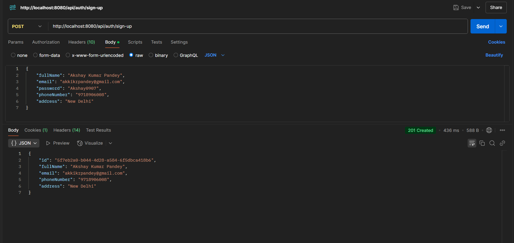
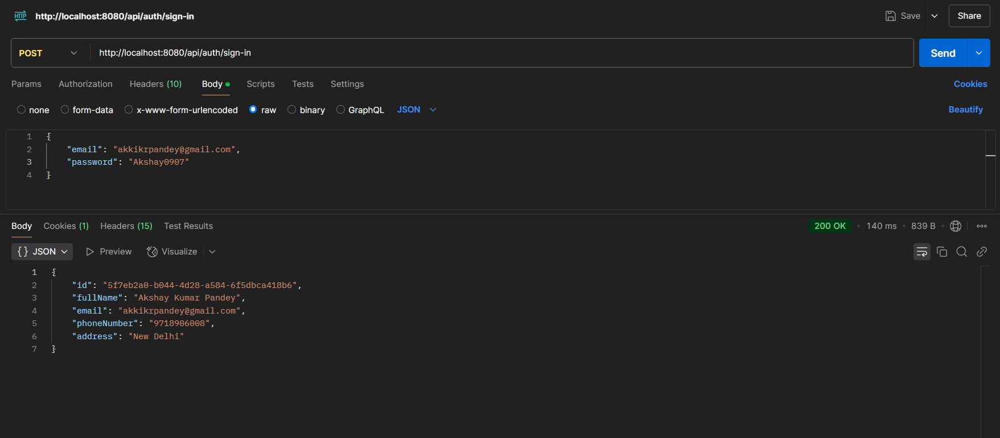
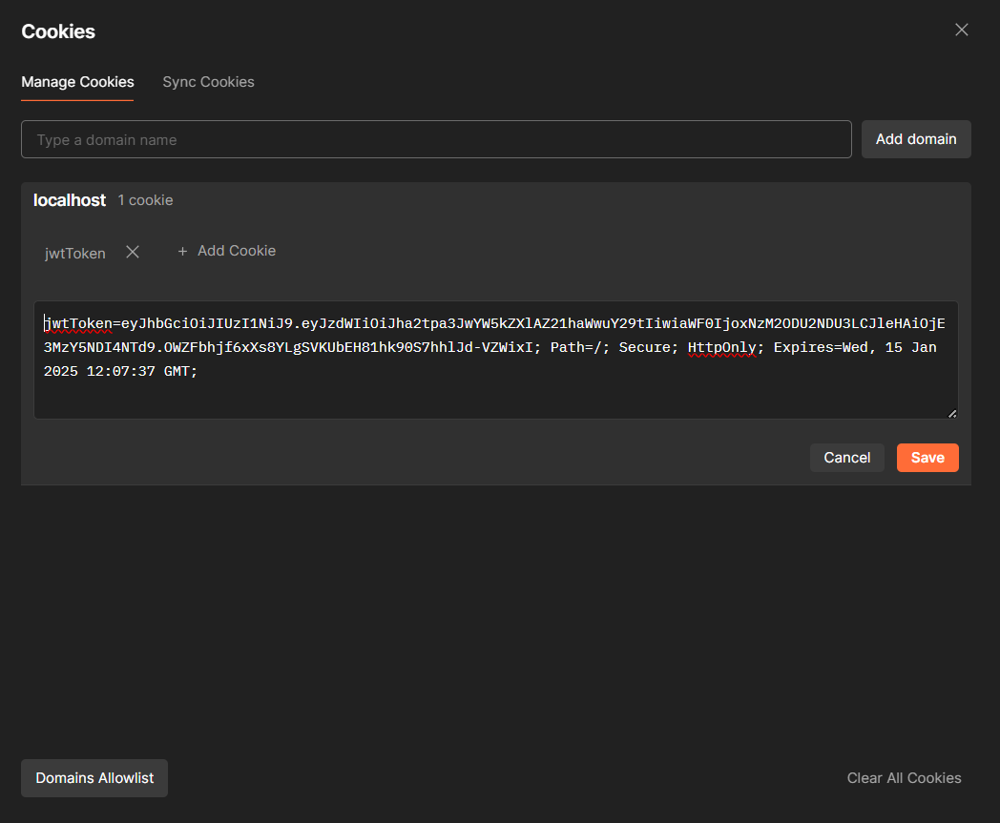
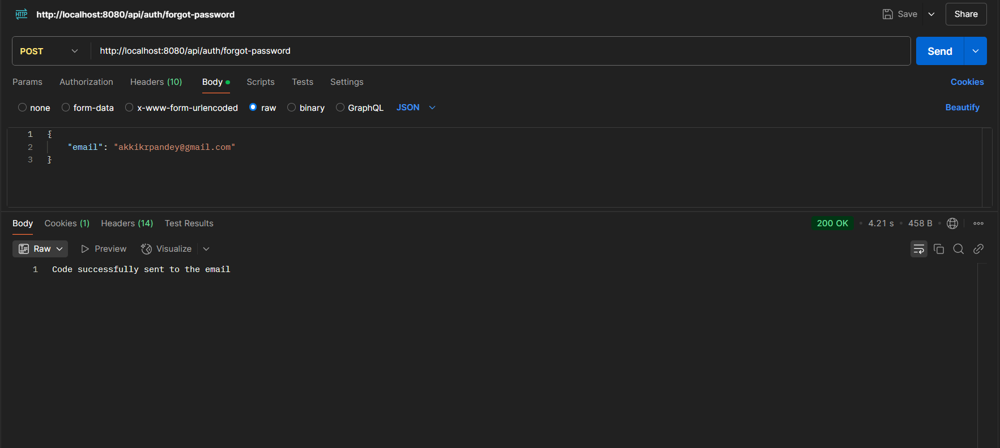
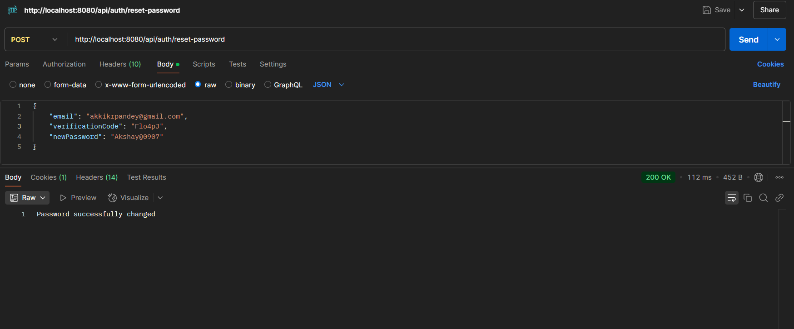
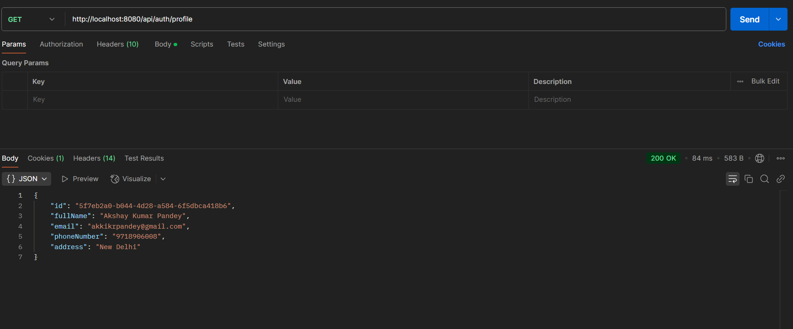
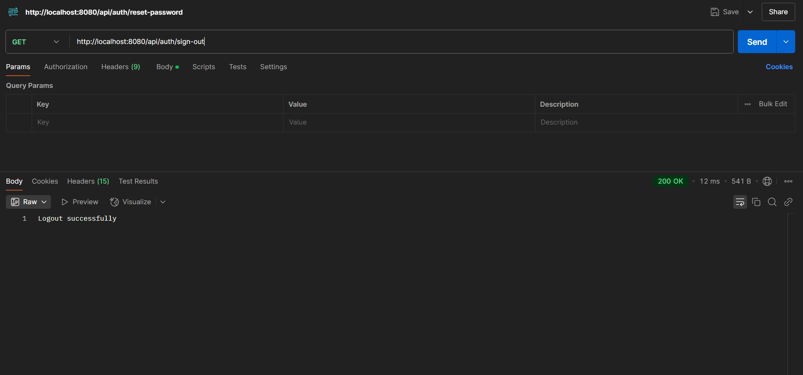
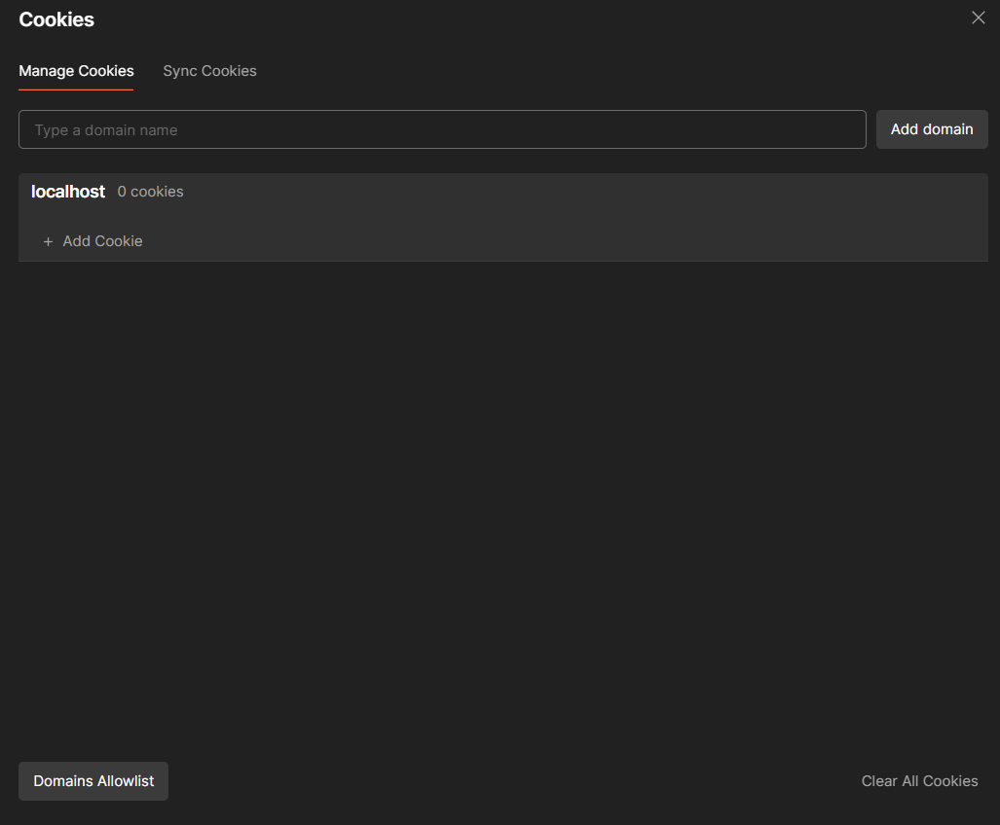

# AI for a Better World - Backend Task Documentation

## Project Overview

This is the backend for the Zenofy.me task. It provides RESTful APIs for user authentication, registration, and password reset functionality. The backend is built with Spring Boot and uses JWT for stateless authentication.

## Features

1. User registration
2. User authentication with JWT
3. Password reset functionality
4. Email verification for password reset
5. Stateless authentication using Spring Security
6. H2 In-memory Database

## Technologies Used

- Spring Boot 3.x
- Spring Security
- Spring Data JPA
- H2 Database (for development)
- JavaMailSender (for sending emails)
- JSON Web Tokens (JWT) for authentication
- Lombok (for reducing boilerplate code)
- JUnit and Mockito (for unit testing)

## Project Structure

```
/src
/main
/java
  /com
    /example
      /demo
        /config
          SecurityConfig.java
          JwtAuthenticationFilter.java
        /controller
          AuthController.java
        /forms
          ForgotPass.java
          LoginForm.java
          ResetPasswordForm.java
          SignUpForm.java
        /model
          User.java
          VerificationCode.java
        /repository
          UserRepository.java
          VerificationCodeRepository.java
        /service
          /impl
            AuthServiceImpl.java
          AuthService.java
        /util
          JwtUtil.java
          MailSenderUtil.java
          ResetCodeUtil.java
        /enums
          CodeType.java
        DemoApplication.java
/resources
  application.properties
/test
/java
  /com
    /example
      /demo
        /controller
          AuthControllerTest.java
        /service
          UserServiceTest.java
```

## Setup and Installation

1. Clone the repository:

   ```bash
   git clone <repository-url>
   cd <project-folder>
   ```

2. Ensure you have JDK 21 or later installed.

3. Build the project:

   ```bash
   ./mvnw clean install
   ```

4. Run the application:

   ```bash
   ./mvnw spring-boot:run
   ```

5. The server will start on `http://localhost:8080`

## Configuration

Key configurations in `application.properties`:

```properties
spring.application.name=demo

spring.datasource.url=jdbc:h2:mem:testdb;Mode=MySQL
spring.datasource.driverClassName=org.h2.Driver
spring.datasource.username=sa
spring.datasource.password=
spring.jpa.database-platform=org.hibernate.dialect.H2Dialect
spring.jpa.hibernate.ddl-auto=update
spring.jpa.generate-ddl=true

#enabling the H2 console
spring.h2.console.enabled=true

#persist the data
#spring.datasource.url=jdbc:h2:file:/data/sampledata

spring.mail.host=smtp.gmail.com
spring.mail.port=587
spring.mail.username=
spring.mail.password=
spring.mail.protocol=smtp
spring.mail.properties.mail.smtp.auth=true
spring.mail.properties.mail.smtp.starttls.enabled=true
spring.mail.properties.mail.smtp.starttls.required=true

```

## API Endpoints

### User Registration

- **URL**: `/api/auth/sign-up`
- **Method**: POST
- **Request Body**:
  ```json
  {
    "fullName": "Akshay Kumar Pandey",
    "email": "akkikrpandey@gmail.com",
    "password": "Akshay0907",
    "phoneNumber": "9718906008",
    "address": "New Delhi"
  }
  ```
- **Response**: User object with the success message



### User Login

- **URL**: `/api/auth/sign-in`
- **Method**: POST
- **Request Body**:
  ```json
  {
    "email": "akkikrpandey@gmail.com",
    "password": "Akshay0907"
  }
  ```
- **Response**: JWT token




### Forgot Password

- **URL**: `/api/auth/forgot-password`
- **Method**: POST
- **Request Body**:
  ```json
  {
    "email": "akkikrpandey@gmail.com"
  }
  ```
- **Response**: Success message




### Reset Password

- **URL**: `/api/auth/reset-password`
- **Method**: POST
- **Request Body**:
  ```json
  {
    "email": "akkikrpandey@gmail.com",
    "verificationCode": "Flo4pJ",
    "newPassword": "Akshay@0907"
  }
  ```
- **Response**: Success message



### Get User Profile

- **URL**: `/api/auth/profile`
- **Method**: GET
- **Cookies**: jwtToken
- **Response**: User profile information



### Logout User

- **URL**: `/api/auth/sign-out`
- **Method**: GET
- **Cookies**: jwtToken
- **Response**: Clears the jwtToken and returns a 200 response




## Authentication Flow

1. User registers or logs in.
2. Server validates credentials.
3. On successful authentication, server generates JWT.
4. JWT is sent back to the client.
5. Client includes JWT in the cookies for subsequent requests.
6. Server validates JWT for each request to protected endpoints.

## Password Reset Flow

1. User requests password reset.
2. Server generates verification code and sends email.
3. User submits verification code along with new password to the /reset-password endpoint.
4. Server verifies code and updates password.

## Security Implementation

- Uses Spring Security for authentication and authorization.
- JWT tokens for stateless authentication.
- Passwords are hashed using BCrypt.
- CORS configuration to allow requests from frontend origin.

## Email Service

- Uses JavaMailSender for sending emails.
- Configured to use Gmail SMTP (can be changed in application.properties).
- Sends verification codes for password reset.

## Verification Code Model

```java
@Entity
@Data
@NoArgsConstructor
@AllArgsConstructor
@Builder
public class VerificationCode {
    @Id
    @GeneratedValue(strategy = GenerationType.UUID)
    private String id;

    @ManyToOne
    @JoinColumn(name = "userId", nullable = false)
    private User user;

    @NotBlank(message = "Code is required")
    private String code;

    @Enumerated(EnumType.STRING)
    private CodeType type;
}
```

- Used for storing verification codes for password reset.
- Associated with a user.
- Has a type (e.g., PASSWORD_RESET) defined in the CodeType enum.

## User Model

```java
@Entity
@Getter
@Setter
@NoArgsConstructor
@AllArgsConstructor
@Builder
@Table(name = "users")
public class User implements UserDetails {
    @Id
    @GeneratedValue(strategy = GenerationType.UUID)
    private String id;

    @NotBlank(message = "Full name is required")
    @Size(min = 2, max = 50, message = "Full name must be between 2 and 50 characters")
    private String fullName;

    @NotBlank(message = "Email is required")
    @Email(message = "Invalid email format")
    @Column(unique = true)
    private String email;

    @JsonIgnore
    @NotBlank(message = "Password is required")
    @Size(min = 8, message = "Password must be at least 8 characters long")
    private String password;

    @NotBlank(message = "Phone number is required")
    @Pattern(regexp = "^\\+?[0-9]{8,12}$", message = "Phone number must be valid contain 8-12 digits")
    private String phoneNumber;

    @NotBlank(message = "Address is required")
    @Size(max = 255, message = "Address must not exceed 255 characters")
    private String address;

    @JsonIgnore
    @OneToMany(mappedBy = "user", cascade = CascadeType.ALL, orphanRemoval = true)
    private Set<VerificationCode> verificationCodes;

    @Override
    @JsonIgnore
    public Collection<? extends GrantedAuthority> getAuthorities() {
        return List.of();
    }

    @Override
    @JsonIgnore
    public String getUsername() {
        return "";
    }

    @Override
    @JsonIgnore
    public boolean isAccountNonExpired() {
        return true;
    }

    @Override
    @JsonIgnore
    public boolean isAccountNonLocked() {
        return true;
    }

    @Override
    @JsonIgnore
    public boolean isCredentialsNonExpired() {
        return true;
    }

    @Override
    @JsonIgnore
    public boolean isEnabled() {
        return true;
    }
}
```

- Used for creating and authenticating users.
- Associated with verification codes in a OneToMany relationship.
- It contains email, password, full name, address and phone number.

## Database

- Uses H2 in-memory database for development.
- Can be easily switched to a production database like PostgreSQL.

## Testing

- Unit tests for controllers and services.
- Framework Used: JUnit and Spring Boot
- Example test class: `AuthControllerTest.java`
- Mock Test Code for Login Functionality and More


### Key Features:
- Login
- Sign-Up
- Password Reset
- Input Validation
- Testing with Mock Objects
- Main Goal: Ensure these key functions work as expected and meet all requirements.

### Tests Explained:
#### 1. Sign-Up Test (Valid Input)
```java
    @Test
    public void testSignup_validInput() throws Exception {
        SignUpForm signUpForm = new SignUpForm();

        signUpForm.setEmail("test@test.com");
        signUpForm.setPassword("test1234");
        signUpForm.setFullName("test user");
        signUpForm.setPhoneNumber("1234567890");
        signUpForm.setAddress("test address");

        mockMvc.perform(MockMvcRequestBuilders.post("/api/auth/sign-up")
                .contentType("application/json")
                .content(TestUtils.convertObjectToJsonBytes(signUpForm)))
                .andExpect(status().isCreated());
    }
```
#### Objective: Test valid input for user registration.
#### Process:
- Creates a new SignUpForm object.
- Sets valid email, password, etc.
- Validates response.
- Expected Outcome: Success (status code 201). 

#### 2. Sign-Up Test (Invalid Input)

#### Objective: Ensure invalid input prompts error.
#### Process:
- Inputs incomplete/incorrect data.
- Ensures validation errors are captured.
- Expected Outcome: Error response.
- Login Test

```java
    // as our database is in memory, so this test will return 404 as there is no user stored in the database
    // we can make our h2 database persistent in disk and then test this fully
    @Test
    public void testLogin_validInput() throws Exception {
        LoginForm loginForm = new LoginForm();

        loginForm.setEmail("test@test.com");
        loginForm.setPassword("test1234");

        mockMvc.perform(MockMvcRequestBuilders.post("/api/auth/sign-in")
                .contentType("application/json")
                .content(TestUtils.convertObjectToJsonBytes(loginForm)))
                .andExpect(status().isNotFound());
    }
```
#### Objective: Simulate login attempts, verify both valid and invalid cases.
#### Process:
- Attempts a login with valid credentials.
- If response is 404, ensures user accounts or backend database review.
- Expected Outcome:  
    Success: Proper credentials.  
    Failure: The fields are not passing the validations are logged with their error messages.

#### 3. Password Reset Test (Invalid Input)

```java
    @Test
    public void testResetPassword_invalidInput() throws Exception {
        ResetPasswordForm resetPasswordForm = new ResetPasswordForm();

        resetPasswordForm.setEmail("test@");
        resetPasswordForm.setVerificationCode("1234");
        resetPasswordForm.setNewPassword("user");

        mockMvc.perform(MockMvcRequestBuilders.post("/api/auth/reset-password")
                .contentType("application/json")
                .content(TestUtils.convertObjectToJsonBytes(resetPasswordForm)))
                .andExpect(status().isBadRequest())
                .andExpect(jsonPath("$.email").exists())
                .andExpect(jsonPath("$.verificationCode").exists())
                .andExpect(jsonPath("$.newPassword").exists());
    }
```

#### Objective: Validate reset of passwords securely.
#### Process:
- Adds invalid input with user test credentials.
- Checks if proper fields and their values.
- Invalid Reset: Incorrect fields are returned with their error messages with a Bad Request status code(400).

### How to Run the Tests:
- There is a run button on each of the test, the simple way to run it is using that button if you are using IntelliJ code editor.
- Execute code through JUnit (integrate into build pipeline).
- MockMvc.autoConfigure to ensure HTTP routing mirrors HTTP API routes.

## Scalability

- Stateless authentication allows for easy horizontal scaling.
- Can be containerized using Docker for easy deployment and scaling.

## Future Improvements

- Implement refresh tokens for enhanced security.
- Add rate limiting to prevent abuse.
- Implement OAuth2 for third-party authentication.

## Run The Project

1. Run the Application
- Run the Spring Boot application by using the main class annotated with @SpringBootApplication.

    ```bash
    ./mvnw spring-boot:run  # For Windows
    mvnw spring-boot:run # For macOS/Linux
    ```
2. Access the Application
Once the application is running, you can access it in a web browser by navigating to:

    ```bash
    http://localhost:8080
    ```

## Deployment

1. Build the JAR file:
   ```bash
   ./mvnw clean package
   ```
2. Run the JAR file:
   ```bash
   java -jar target/demo-0.0.1-SNAPSHOT.jar
   ```
3. For production, consider using a process manager like systemd or deploying to a cloud platform like Heroku or AWS Elastic Beanstalk.

